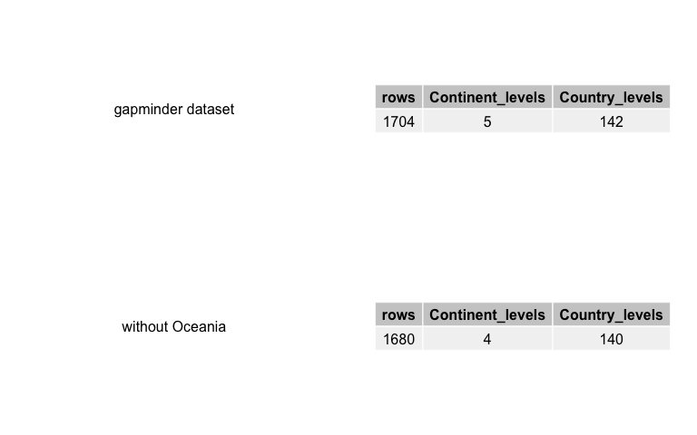
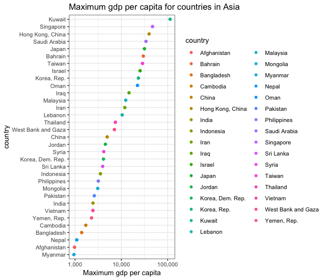
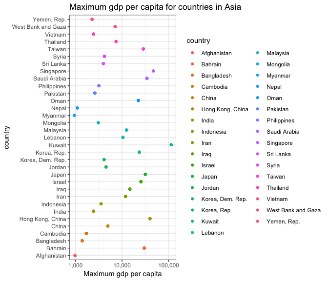
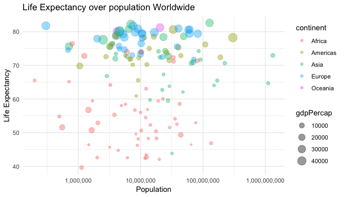
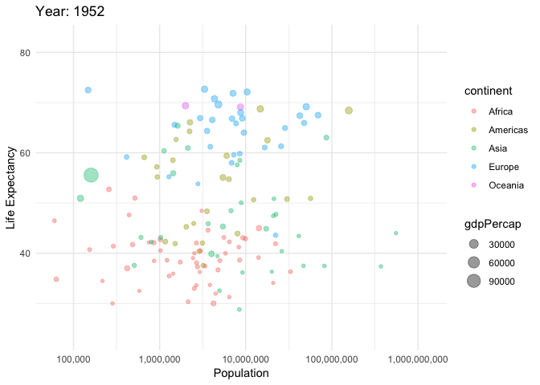
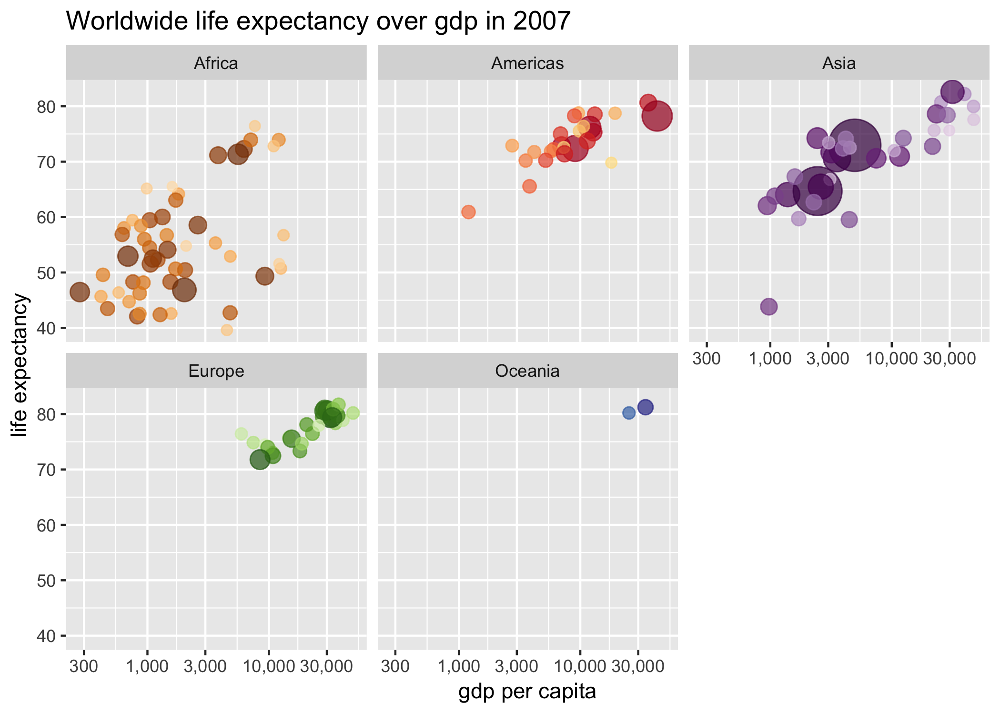
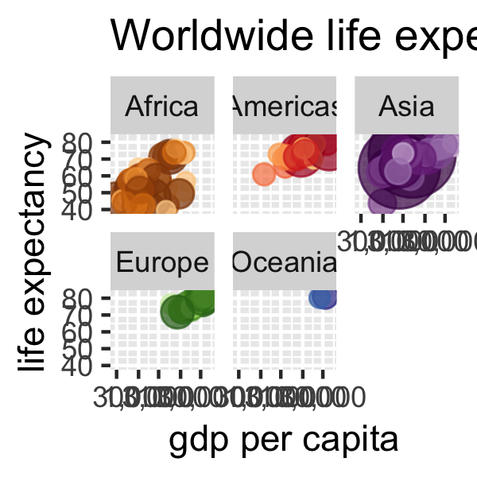
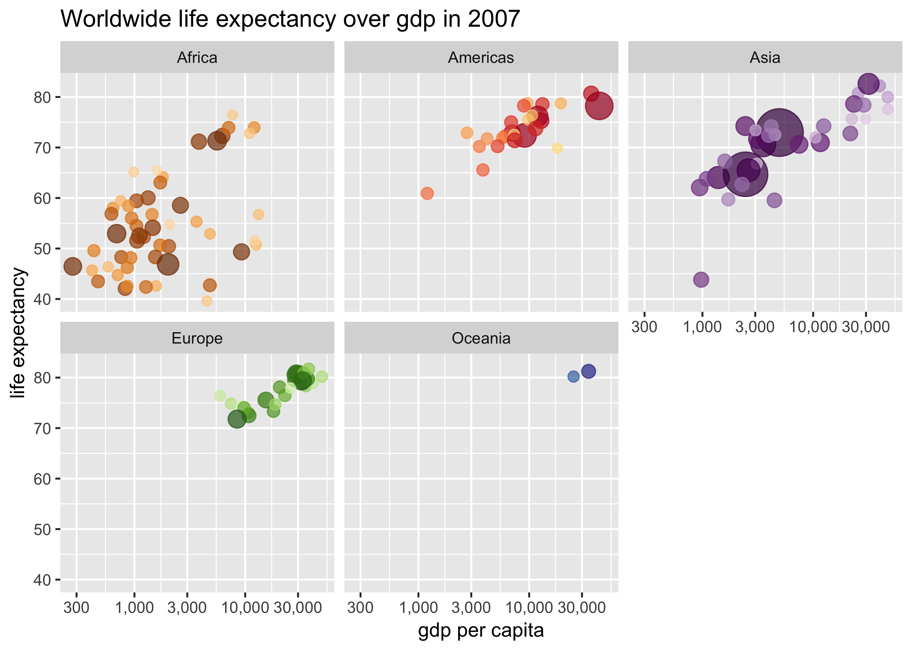
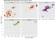
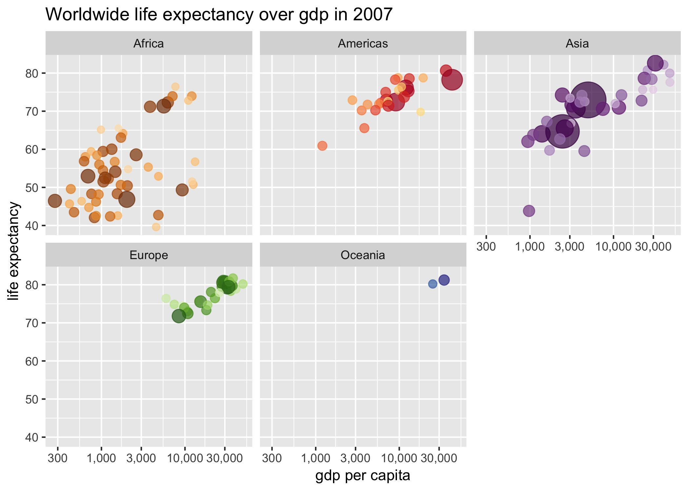

Homework 05: Factor and figure management
================
Stefanie Lumnitz
19 October, 2018

### Load required packages

``` r
suppressPackageStartupMessages(library(gapminder))
suppressPackageStartupMessages(library(tidyverse))
suppressPackageStartupMessages(library(knitr))
suppressPackageStartupMessages(library(plotly))
suppressPackageStartupMessages(library(gridExtra))
suppressPackageStartupMessages(library(grid))
suppressPackageStartupMessages(library(scales))
suppressPackageStartupMessages(library(gganimate))
```

# Part 1: Factor management

## Functions:

| function                                  | use                       |
| ----------------------------------------- | ------------------------- |
| `factor(x)` or `forcats::parse_factor(x)` | convert x into a factor   |
| `levels()`                                | value of levels of factor |
| `nlevels()`                               | count of levels of factor |
| `forcats::fct_count()`                    | count                     |
| `droplevels()`                            | drop levels               |

FIirst I will be checking wether there are any factors in our gapminder
dataset:

``` r
glimpse(gapminder)
#> Observations: 1,704
#> Variables: 6
#> $ country   <fct> Afghanistan, Afghanistan, Afghanistan, Afghanistan, ...
#> $ continent <fct> Asia, Asia, Asia, Asia, Asia, Asia, Asia, Asia, Asia...
#> $ year      <int> 1952, 1957, 1962, 1967, 1972, 1977, 1982, 1987, 1992...
#> $ lifeExp   <dbl> 28.801, 30.332, 31.997, 34.020, 36.088, 38.438, 39.8...
#> $ pop       <int> 8425333, 9240934, 10267083, 11537966, 13079460, 1488...
#> $ gdpPercap <dbl> 779.4453, 820.8530, 853.1007, 836.1971, 739.9811, 78...
```

Indeed, `country` and `continent` are factors, delineated by `<fct>`.

``` r
sapply(gapminder, nlevels) %>% 
  kable()
```

|           |   x |
| --------- | --: |
| country   | 142 |
| continent |   5 |
| year      |   0 |
| lifeExp   |   0 |
| pop       |   0 |
| gdpPercap |   0 |

`nlevels()` shows us, that `country` has `142` levels, whereas
`continent` has `5`. `year`, `lifeExp`, `pop` and `gdpPercap` do not
have levels since they are not factors, how we discovered earlier. Let’s
test this in more detail:

``` r
sapply(gapminder, is.factor) %>% 
  kable()
```

|           | x     |
| --------- | :---- |
| country   | TRUE  |
| continent | TRUE  |
| year      | FALSE |
| lifeExp   | FALSE |
| pop       | FALSE |
| gdpPercap | FALSE |

Let’s select all columns or variables for which `is.factor` is `TRUE`
and check which values the `levels` contain:

``` r
select_if(gapminder, is.factor) %>% 
sapply(levels)
#> $country
#>   [1] "Afghanistan"              "Albania"                 
#>   [3] "Algeria"                  "Angola"                  
#>   [5] "Argentina"                "Australia"               
#>   [7] "Austria"                  "Bahrain"                 
#>   [9] "Bangladesh"               "Belgium"                 
#>  [11] "Benin"                    "Bolivia"                 
#>  [13] "Bosnia and Herzegovina"   "Botswana"                
#>  [15] "Brazil"                   "Bulgaria"                
#>  [17] "Burkina Faso"             "Burundi"                 
#>  [19] "Cambodia"                 "Cameroon"                
#>  [21] "Canada"                   "Central African Republic"
#>  [23] "Chad"                     "Chile"                   
#>  [25] "China"                    "Colombia"                
#>  [27] "Comoros"                  "Congo, Dem. Rep."        
#>  [29] "Congo, Rep."              "Costa Rica"              
#>  [31] "Cote d'Ivoire"            "Croatia"                 
#>  [33] "Cuba"                     "Czech Republic"          
#>  [35] "Denmark"                  "Djibouti"                
#>  [37] "Dominican Republic"       "Ecuador"                 
#>  [39] "Egypt"                    "El Salvador"             
#>  [41] "Equatorial Guinea"        "Eritrea"                 
#>  [43] "Ethiopia"                 "Finland"                 
#>  [45] "France"                   "Gabon"                   
#>  [47] "Gambia"                   "Germany"                 
#>  [49] "Ghana"                    "Greece"                  
#>  [51] "Guatemala"                "Guinea"                  
#>  [53] "Guinea-Bissau"            "Haiti"                   
#>  [55] "Honduras"                 "Hong Kong, China"        
#>  [57] "Hungary"                  "Iceland"                 
#>  [59] "India"                    "Indonesia"               
#>  [61] "Iran"                     "Iraq"                    
#>  [63] "Ireland"                  "Israel"                  
#>  [65] "Italy"                    "Jamaica"                 
#>  [67] "Japan"                    "Jordan"                  
#>  [69] "Kenya"                    "Korea, Dem. Rep."        
#>  [71] "Korea, Rep."              "Kuwait"                  
#>  [73] "Lebanon"                  "Lesotho"                 
#>  [75] "Liberia"                  "Libya"                   
#>  [77] "Madagascar"               "Malawi"                  
#>  [79] "Malaysia"                 "Mali"                    
#>  [81] "Mauritania"               "Mauritius"               
#>  [83] "Mexico"                   "Mongolia"                
#>  [85] "Montenegro"               "Morocco"                 
#>  [87] "Mozambique"               "Myanmar"                 
#>  [89] "Namibia"                  "Nepal"                   
#>  [91] "Netherlands"              "New Zealand"             
#>  [93] "Nicaragua"                "Niger"                   
#>  [95] "Nigeria"                  "Norway"                  
#>  [97] "Oman"                     "Pakistan"                
#>  [99] "Panama"                   "Paraguay"                
#> [101] "Peru"                     "Philippines"             
#> [103] "Poland"                   "Portugal"                
#> [105] "Puerto Rico"              "Reunion"                 
#> [107] "Romania"                  "Rwanda"                  
#> [109] "Sao Tome and Principe"    "Saudi Arabia"            
#> [111] "Senegal"                  "Serbia"                  
#> [113] "Sierra Leone"             "Singapore"               
#> [115] "Slovak Republic"          "Slovenia"                
#> [117] "Somalia"                  "South Africa"            
#> [119] "Spain"                    "Sri Lanka"               
#> [121] "Sudan"                    "Swaziland"               
#> [123] "Sweden"                   "Switzerland"             
#> [125] "Syria"                    "Taiwan"                  
#> [127] "Tanzania"                 "Thailand"                
#> [129] "Togo"                     "Trinidad and Tobago"     
#> [131] "Tunisia"                  "Turkey"                  
#> [133] "Uganda"                   "United Kingdom"          
#> [135] "United States"            "Uruguay"                 
#> [137] "Venezuela"                "Vietnam"                 
#> [139] "West Bank and Gaza"       "Yemen, Rep."             
#> [141] "Zambia"                   "Zimbabwe"                
#> 
#> $continent
#> [1] "Africa"   "Americas" "Asia"     "Europe"   "Oceania"
```

This returns all factor levels alphabetically sorted.

## Drop Oceania and remove unused factor levels

> Filter the Gapminder data to remove observations associated with the
> continent of Oceania. Additionally, remove unused factor levels.
> Provide concrete information on the data before and after removing
> these rows and Oceania; address the number of rows and the levels of
> the affected
factors.

``` r
drop_continent <- c("Oceania") # use vector to easily change which continent to drop

rm_oceania <- gapminder %>% 
  filter(continent != drop_continent)
  
unique(rm_oceania$continent) # check if Oceania obervations are removed
#> [1] Asia     Europe   Africa   Americas
#> Levels: Africa Americas Asia Europe Oceania
```

We can see here that eventhough all observations of `Oceania` have been
removed, the factor level Oceania is still present but unused. Let’s
remove these unused factor levels and compare the gapminder dataset
before and after. For an easy comparison I provide this function that
can help visualize results in one go:

``` r
mysummary_table <- function(df) {
  tab <- data.frame(
    "rows" = nrow(df),
    "Continent_levels" = nlevels(df$continent),
    "Country_levels" = nlevels(df$country))
  return(tab)
}
```

``` r
drop_continent <- c("Oceania") # use vector to easily change which continent to drop

five_continents <- gapminder %>% 
    mysummary_table()
    
four_continents <- gapminder %>% 
  filter(continent != drop_continent) %>% 
  droplevels() %>% 
  mysummary_table() 

grid.arrange(textGrob("gapminder dataset",gp=gpar(fontsize=12)),
             tableGrob(five_continents, rows=NULL),
             textGrob("without Oceania",gp=gpar(fontsize=12)),
             tableGrob(four_continents, rows=NULL), ncol=2)
```

<!-- -->

We can see than we removed 24 rows, one continent factor level and 2
country factor levels. Let’s find out which countries have been removed:

``` r
gapminder %>% 
  filter(continent=="Oceania") %>% 
  select(country) %>% 
  unique() %>% 
  kable()
```

| country     |
| :---------- |
| Australia   |
| New Zealand |

## Reorder the levels of country or continent using `forcats`

> Reorder the levels of country or continent. Use the forcats package to
> change the order of the factor levels, based on a principled summary
> of one of the quantitative variables. Consider experimenting with a
> summary statistic beyond the most basic choice of the median.

Remember that countries and continents were ordered in alphabetical
order as shown above, let’s try to change this order, sicne it does not
always make sense to display data alphabetically ordered.

In order to provide nice visualization on how and what changes, I will
use the `Maximum GdP` variable over the timeframe of 1952-2007 for all
countries in Asia as an example. Let’s see how `fct_reorder` and
`arrange()`:

``` r

gapminder %>%
  filter(continent == "Asia") %>% 
  group_by(country) %>% 
  mutate(max_gdpPercap = max(gdpPercap)) %>%
  ggplot(aes(x = max_gdpPercap, y = fct_reorder(country, gdpPercap, max),
             color = country)) +
  geom_point() + 
  scale_x_log10(labels=comma_format()) +
  xlab("Maximum gdp per capita") +
  ylab("country") +
  labs(title = "Maximum gdp per capita for countries in Asia") +
  theme_bw()
```

<!-- -->

In comparison, how does our visualization look like if we use
`arrange()` for this task:

``` r

gapminder %>%
  filter(continent == "Asia") %>% 
  group_by(country) %>% 
  mutate(max_gdpPercap = max(gdpPercap)) %>%
  arrange(max_gdpPercap) %>% 
  ggplot(aes(x = max_gdpPercap, y = country,
             color = country)) +
  geom_point() + 
  scale_x_log10(labels=comma_format()) +
  xlab("Maximum gdp per capita") +
  ylab("country") +
  labs(title = "Maximum gdp per capita for countries in Asia") +
  theme_bw()
```

<!-- -->

We can see that `arrange()` alone does not change the order of levels in
a factor.How does it change if both `arrange()` and `fct_reorder()` are
used:

``` r

gapminder %>%
  filter(continent == "Asia") %>% 
  group_by(country) %>% 
  mutate(max_gdpPercap = max(gdpPercap)) %>%
  arrange(max_gdpPercap) %>% 
  ggplot(aes(x = max_gdpPercap, y = fct_reorder(country, gdpPercap, max),
             color = country)) +
  geom_point() + 
  scale_x_log10(labels=comma_format()) +
  xlab("Maximum gdp per capita") +
  ylab("country") +
  labs(title = "Maximum gdp per capita for countries in Asia") +
  theme_bw()
```

<!-- -->

Not surprising, `fct_reorder()` takes the lead and orders our levels.

# Part 2: File I/O and I want to do more

> Experiment with one or more of write\_csv()/read\_csv() (and/or TSV
> friends), saveRDS()/readRDS(), dput()/dget(). Create something new,
> probably by filtering or grouped-summarization of Singer or Gapminder.
> I highly recommend you fiddle with the factor levels, i.e. make them
> non-alphabetical (see previous section). Explore whether this survives
> the round trip of writing to file then reading back in

### My new dataset

``` r
beverage <- tribble( # create a tibble
                    ~country, ~beverage,
                    "Germany", "beer",
                    "Mexico", "tequila",
                    "France", "wine",
                    "Russia", "vodka",
                    "Japan", "sake",
                    "Grece", "ouzo",
                    "Italy", "ramazotti")

popularity <- tribble( # create a tibble
                    ~beverage, ~popularity,
                    "beer", 1,
                    "tequila", 7,
                    "wine", 2,
                    "vodka", 6,
                    "sake", 5,
                    "ouzo", 3,
                    "ramazotti", 4)

# convert all columns to factors:
beverage[] <- lapply(beverage, factor) # "[]" keeps the dataframe structure
 col_names <- names(beverage)

world_beverage <- right_join(beverage, popularity)
#> Joining, by = "beverage"
#> Warning: Column `beverage` joining factor and character vector, coercing
#> into character vector

# Check
glimpse(world_beverage)
#> Observations: 7
#> Variables: 3
#> $ country    <fct> Germany, Mexico, France, Russia, Japan, Grece, Italy
#> $ beverage   <chr> "beer", "tequila", "wine", "vodka", "sake", "ouzo",...
#> $ popularity <dbl> 1, 7, 2, 6, 5, 3, 4
```

This dataset will be used to test if changed factor levels will be kept
while data is saved and reloaded in multiple packages.
[Stackoverflow](https://stackoverflow.com/questions/9251326/convert-data-frame-column-format-from-character-to-factor)
helped me to create this factor-df. Interestingly, a join converts our
variable `beverage` back to a `character`

## Comparison

Orignal dataframe:

``` r
write_csv(world_beverage, "world_beverage_csv.csv")
df_csv <- read_csv("world_beverage_csv.csv")
#> Parsed with column specification:
#> cols(
#>   country = col_character(),
#>   beverage = col_character(),
#>   popularity = col_integer()
#> )

saveRDS(world_beverage, "world_beverage_rds.rds")
df_rds <- readRDS("world_beverage_rds.rds")

dput(world_beverage, "world_beverage.txt")
df_get <- dget("world_beverage.txt")

comparison <- data.frame(
    "csv" = sapply(df_csv, class),
    "rds" = sapply(df_rds, class),
    "get" = sapply(df_get, class))

kable(comparison)
```

|            | csv       | rds       | get       |
| ---------- | :-------- | :-------- | :-------- |
| country    | character | factor    | factor    |
| beverage   | character | character | character |
| popularity | integer   | numeric   | numeric   |

The comparison shows that `rds` and `txt` formats automatically parse to
factor when saved or loaded. `read_csv()` on the other hand
automatically parses variables and I get this message in the command
line, while a check reveales that the data frame does not contain
factors anymore:

    Parsed with column specification:
    cols(
      country = col_character(),
      beverage = col_character(),
      popularity = col_integer()
    )

The `read_csv()` documentation suggests:

> col\_factor() (f) allows you to load data directly into a factor if
> you know what the levels are.

what happens if I specify these while loading:

``` r
# df_csv <- read_csv("world_beverage_csv.csv",
#                   col_types = cols(country = col_factor(),
#                                    beverage = col_factor(),
#                                    popularity = col_factor()
#                                    )
# )
```

It seems like this is not as straight forward as one also has to know
the levels. And there is no option to safe these with the `.csv`
according to the `write_csv()`
\[documentation\](<https://www.rdocumentation.org/packages/readr/versions/0.1.1/topics/write_csv>.
The best way forward to handle factors is therefore to choose one of the
other two formats.

# Part 3: Visualization design

In this part I experiment with the
[graphics](https://www.youtube.com/watch?v=hVimVzgtD6w) for which
[gapminder](https://www.gapminder.org) got known: visualizing life
expectancy over time. I however will explore how the connection between
life expectancy, the population size and gdp per capita looks like for
2007 looks like.

``` r
plot <- gapminder %>% 
  filter(year == "2007") %>% 
  ggplot(aes(pop, lifeExp, size = gdpPercap, color = continent)) +
  geom_point(alpha=0.4) +
  scale_x_log10(labels=comma_format()) +
  ggtitle("Life Expectancy over population Worldwide") +
  xlab("Population") +
  ylab("Life Expectancy") +
  theme_minimal()
plot
```

<!-- -->

In order to be able to zoome in and out and assess which data point
belongs to which country, we are going to plot this graph more
interactively with `plotly`:

``` r
# plot %>% 
#     ggplotly()
```

And thanks to
[`huangjieying`](https://github.com/STAT545-UBC-students/hw05-huangjieying/blob/master/hw05_factor_and_figure_management.md),
I found out about this amazing interactive visualization tool called
[`gganimate`](https://github.com/thomasp85/gganimate). In order to
install the animation package use:

``` r
# library(devtools) # load devtools package
# devtools::install_github('thomasp85/gganimate',force = TRUE) 
```

``` r

ggplot(gapminder, aes(pop, lifeExp, size = gdpPercap, color = continent)) +
geom_point(alpha=0.4) +
scale_x_log10(labels=comma_format()) +
theme_minimal() +
labs(title = 'Year: {frame_time}', x = 'Population', y = 'Life Expectancy') +
transition_time(year) # This needs to be added for gganimate
```

<!-- -->

# Part 4: Writing figures to file

> Use ggsave() to explicitly save a plot to file. Then use `` to load and embed it in your report. You can
> play around with various options, such as:

> Arguments of ggsave(), such as width, height, resolution or text
> scaling. Various graphics devices, e.g. a vector vs. raster format.
> Explicit provision of the plot object p via ggsave(…, plot = p). Show
> a situation in which this actually matters.

Let’s make another plot and save it:

``` r
Life_Expectancy_viz <- gapminder %>% 
  filter(year == "2007") %>% 
  ggplot(aes(gdpPercap, lifeExp, size = pop, colour = country)) +
  geom_point(alpha = 0.7, show.legend = FALSE) +
  scale_colour_manual(values = country_colors) +
  scale_size(range = c(2, 12)) +
  scale_x_log10(labels=comma_format()) +
  facet_wrap(~continent) +
  labs(title = 'Worldwide life expectancy over gdp in 2007', x = 'gdp per capita', y = 'life expectancy')

ggsave("./plot/life_expectancy_viz.png")
#> Saving 7 x 5 in image
```



Different heights
andresolutions:

``` r
ggsave("./plot/viz_small.png", plot = Life_Expectancy_viz, width = 2, height = 2)

ggsave("./plot/viz_tiny.jpeg", plot = Life_Expectancy_viz, device="jpeg")
#> Saving 7 x 5 in image

ggsave("./plot/viz_high_resolution.png", plot = Life_Expectancy_viz, dpi = 400)
#> Saving 7 x 5 in image

ggsave("./plot/viz_low_resolution.png", plot = Life_Expectancy_viz, dpi = 10)
#> Saving 7 x 5 in image
```



Wee can see, that ggsave is only reducing the size of the graphics, but
not the size of the text dimension. In comparison changing the
resolution scales the size of graphic elements accordingly:





It is also possible to use a different format:


